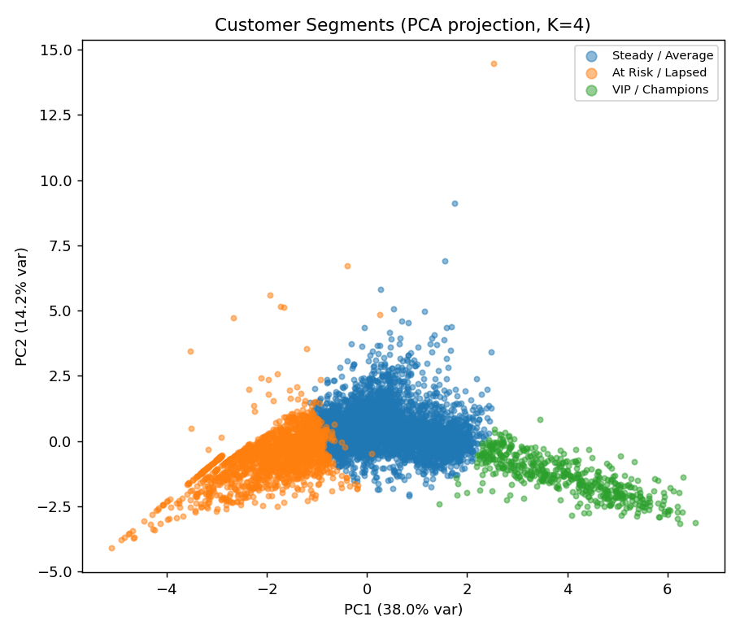
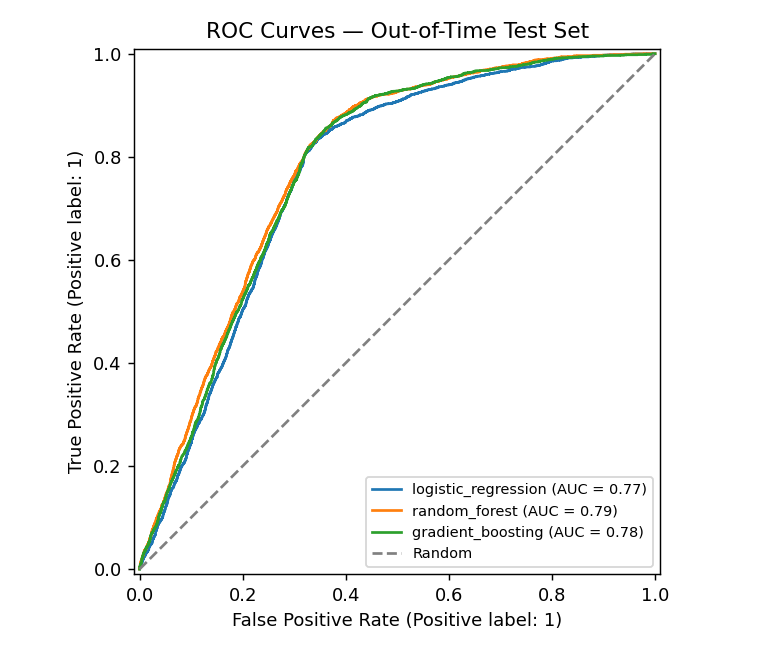
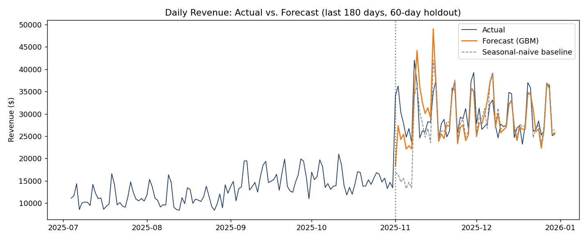

# 📊 RetailIQ — End-to-End Retail Analytics & Forecasting Platform

An end-to-end data analytics platform that takes raw, messy e-commerce transaction data
and turns it into three production-style deliverables: **customer segmentation**,
**churn prediction**, and **revenue forecasting** — served through an interactive
dashboard.

Built to demonstrate the full analytics stack: **SQL** (window functions, CTEs, cohort
analysis), **Python/pandas** (ETL), **scikit-learn** (supervised + unsupervised ML with
proper validation), and **Streamlit/Plotly** (interactive BI).

> 📌 **Note on the data:** this project uses a synthetically generated transaction
> dataset (`src/data_generation.py`), not a scraped or licensed real-world dataset.
> It's generated with realistic seasonality, customer heterogeneity, churn dynamics,
> and deliberately-injected data-quality issues (duplicates, nulls, outliers) — so
> every stage of the pipeline, from cleaning to modeling, does real work on
> real-shaped problems, fully reproducibly (seeded) and without licensing concerns.

---
## Dashboard

### Customer Segmentation


### Future 90-Day Churn Risk


### Revenue Forecast

## Results at a glance

| Component | Metric | Result |
|---|---|---|
| ETL | Rows cleaned | 221,623 → 219,976 (1,647 dupes removed, 2,662 outliers capped) |
| Segmentation | Silhouette-optimal clusters | K=4 (silhouette = 0.282) |
| **Future-churn model** | **ROC-AUC, out-of-time test** | **0.785** (Random Forest — see [Churn Methodology](#churn-methodology-predicting-future-risk-not-current-status)) |
| Future-churn model | PR-AUC / Precision / Recall | 0.326 / 0.312 / 0.792 |
| **Forecast model** | MAE vs. seasonal-naive baseline | **9.0% improvement** (3,258 vs 3,581) |

Full metrics: [`reports/churn_model_metrics.json`](reports/churn_model_metrics.json) ·
[`reports/forecast_metrics.json`](reports/forecast_metrics.json)

---

## Architecture

```
                    ┌─────────────────────┐
                    │  data_generation.py │   synthetic transactions
                    └──────────┬───────────┘   (seasonality, churn, noise)
                               ▼
                    ┌─────────────────────┐
                    │       etl.py        │   clean, dedupe, cap outliers
                    └──────────┬───────────┘   full audit report
                               ▼
              ┌────────────────┴────────────────┐
              ▼                                  ▼
   ┌─────────────────────┐            ┌─────────────────────┐
   │    database.py       │            │    features.py       │
   │  SQLite + SQL (CTEs, │            │  RFM + behavioral     │
   │  window fns, cohorts)│            │  feature engineering  │
   └──────────────────────┘            └──────────┬────────────┘
                                                    ▼
                             ┌──────────────────────┴──────────────────────┐
                             ▼                                              ▼
                  ┌─────────────────────┐                       ┌─────────────────────┐
                  │   segmentation.py    │                       │    churn_panel.py      │
                  │  K-Means (elbow +    │                       │  rolling T0 snapshots,  │
                  │  silhouette-tuned)   │                       │  leakage-safe labels    │
                  └──────────┬────────────┘                       └──────────┬────────────┘
                             │                                                ▼
                             │                                    ┌─────────────────────┐
                             │                                    │    churn_model.py      │
                             │                                    │  LR / RF / GBM,         │
                             │                                    │  temporal train/val/test│
                             │                                    └──────────┬────────────┘
                             └───────────────────┬────────────────────────────┘
                                                  ▼
                                     ┌─────────────────────┐        ┌─────────────────────┐
                                     │   dashboard/app.py    │◄───────│   forecasting.py      │
                                     │  Streamlit + Plotly   │        │  GBM on residual-of-   │
                                     │  interactive BI        │        │  naive-baseline        │
                                     └─────────────────────┘        └─────────────────────┘
```

---

## What each module actually demonstrates

**`src/etl.py`** — Cleaning decisions are logged and auditable, not silent. Negative
quantities are treated as returns and flagged rather than dropped (preserves revenue
signal); outliers are capped via IQR rather than deleted (preserves customer/order
continuity for downstream features).

**`sql/analysis_queries.sql`** — Real SQL, not `SELECT *`: `RANK()`/`NTILE()` for
customer revenue deciles, `LAG()` for month-over-month growth, and a full CTE-based
signup-cohort retention analysis (% of each monthly cohort still active at 1/3/6
months).

**`src/features.py`** — Classic RFM (Recency/Frequency/Monetary) scoring plus
behavioral features (return rate, spend trend, category diversity), computed via a
single `obs_date`-parameterized function reused both for the "current state" dashboard
view and for every historical T0 snapshot in the churn panel (see below).
`recency_days` is deliberately excluded from the churn model's features (it defines
panel eligibility, so including it would leak the sampling logic) — unit-tested in
`tests/test_models.py`.

**`src/segmentation.py`** — K is chosen via elbow + silhouette score, not guessed.
Clusters are translated into business-readable segment names (VIP/Champions, Loyal
Regulars, At Risk/Lapsed) based on centroid characteristics, not left as `cluster_0`,
`cluster_1`.

**`src/churn_panel.py`** — Builds the rolling, leakage-safe training panel described in
[Churn Methodology](#churn-methodology-predicting-future-risk-not-current-status) above:
19 rolling observation snapshots, features computed strictly before T0, labels computed
strictly after it.

**`src/churn_model.py`** — Three model families (Logistic Regression, Random Forest,
Gradient Boosting) compared against a majority-class dummy baseline, selected via a
**chronological train/validation/test split** (not k-fold CV, which would shuffle time
periods together) and evaluated on ROC-AUC/PR-AUC/precision/recall/F1 on an out-of-time
test set touched exactly once.

**`src/forecasting.py`** — Deliberately avoids a black-box `Prophet`/`AutoARIMA` call
so the feature engineering is visible: lag features, rolling stats, calendar effects.
The model predicts the *residual* against a seasonal-naive (same-weekday-last-week)
baseline rather than raw revenue — a real technique for beating a strong baseline
instead of re-deriving weekly seasonality from scratch. (First version lost to naive by
41%; this fix is what got it to +9%.)

**`dashboard/app.py`** — KPI cards, a segment explorer, a ranked churn-risk action
list, and the forecast chart, all driven off the same processed data the pipeline
produces — no separate "demo mode."

**`tests/`** — 18 unit tests covering ETL edge cases (dupes, nulls, sign errors),
feature engineering correctness (recency computed from the dataset's max date, not
wall-clock `today()`), the churn model's feature-level anti-leakage guarantee, and
`test_temporal_leakage.py`'s row-level checks that no feature ever sees a transaction
dated after its T0 and no label ever ignores one dated after it.

---

## Churn methodology: predicting future risk, not current status

**This project went through one real methodological revision, and it's worth explaining
because it's the kind of mistake that's easy to make and important to catch.**

**The original version** defined churn as `is_churned = recency_days > 90` and trained
directly on features computed as of that same observation date (`recency_days` itself
excluded to avoid literal leakage). That model scored **0.988 ROC-AUC** — which sounds
great, but it was answering the wrong question: *"can I distinguish customers who are
currently inactive from customers who are currently active?"* That's a much easier
problem than the one a retention team actually needs solved: *"given what I know about
an active customer right now, will they go quiet in the next 90 days?"* The first is
descriptive; the second is predictive, and it's the one worth building a model for.

**The fix — a rolling, time-based panel:**

1. **Rolling observation points (T0).** Instead of one snapshot, the pipeline generates
   19 snapshots every 45 days across the dataset's history (`src/churn_panel.py`).
2. **Leakage-safe features.** At each T0, every feature (recency, frequency, monetary,
   purchase rate, spend trend, etc.) is computed using **only transactions dated on or
   before T0** — never anything after it.
3. **A genuinely future label.** `future_churn = 1` if the customer makes **zero
   purchases in the 90 days after T0**; the label is built exclusively from data the
   feature computation never saw.
4. **Eligibility filter.** Only customers who had already purchased at least once and
   were still active as of T0 enter the panel — predicting "future churn" for someone
   already churned isn't a meaningful target.
5. **Chronological train / validation / test split**, by T0, not by row:
   - Train: earliest 11 snapshots (2023-07 → 2024-09, ~20.6K rows)
   - Validation: next 3 snapshots (2024-11 → 2025-02, ~10.2K rows), used for model/
     hyperparameter selection
   - Test: most recent 5 snapshots (2025-03 → 2025-09, ~19.0K rows), touched exactly
     once, after model selection was finalized

   A random row-level split would have let the model implicitly "see the future" —
   nearby snapshots of the same customer would land on both sides of the split. The
   chronological split forces the model to generalize to time periods it never trained
   on, which is what actually happens in production.

**The honest result:** ROC-AUC dropped from 0.988 to **0.785** on the out-of-time test
set. That drop is the point, not a regression — it's the difference between a model that
memorizes the present and one that's actually predicting the future. 0.785 ROC-AUC with
0.79 recall at the chosen threshold (catching ~79% of customers who will actually churn)
is a solid, realistic, and defensible number for a 90-day forward-looking retail churn
model — this framing is what makes it hold up under interview scrutiny.

**What's still a simplification** (worth being upfront about): validation uses a single
train/val/test cut rather than multiple rolling-origin folds, which would give a more
robust estimate of variance across time periods. With more historical data this project's
`src/churn_model.py` is structured so that swapping in rolling-origin CV (walk the split
forward across several val/test boundaries and average) is a straightforward extension —
noted here rather than built, to keep the scope shippable.

The RFM-based "current risk" list on the dashboard (`is_churned`, `RFM_score` from
`features.py`) is intentionally kept separate — it's a descriptive "who looks inactive
today" ranking, useful for a retention team's worklist, and is not what the ROC-AUC above
measures.

---

## Screenshots

**Customer segments (PCA projection):**


**Churn model — ROC comparison across model families:**


**Revenue forecast vs. seasonal-naive baseline:**


More figures in [`reports/figures/`](reports/figures/): K-selection diagnostics,
confusion matrix, feature importances for both models.

---

## Project structure

```
retailiq/
├── src/
│   ├── data_generation.py   # synthetic dataset generator
│   ├── etl.py                # cleaning pipeline + audit report
│   ├── database.py           # SQLite loader + SQL runner
│   ├── features.py           # RFM + behavioral feature engineering
│   ├── segmentation.py       # K-Means customer segmentation
│   ├── churn_panel.py        # rolling, leakage-safe future-churn training panel
│   ├── churn_model.py        # future-churn prediction (LR/RF/GBM, temporal split)
│   └── forecasting.py        # revenue forecasting (residual-on-naive)
├── sql/
│   └── analysis_queries.sql  # window functions, CTEs, cohort retention
├── dashboard/
│   └── app.py                 # Streamlit + Plotly interactive dashboard
├── tests/
│   ├── test_etl.py
│   ├── test_features.py
│   ├── test_models.py
│   └── test_temporal_leakage.py  # verifies features never see post-T0 data
├── reports/
│   ├── figures/                # generated charts (committed — see below)
│   ├── churn_model_metrics.json
│   └── forecast_metrics.json
├── models/                     # trained model artifacts (gitignored)
├── data/                       # raw + processed data (gitignored)
├── run_pipeline.py             # orchestrates the full pipeline end-to-end
├── requirements.txt
└── README.md
```

`reports/figures/*.png` and the metrics JSON files **are committed** on purpose, so
anyone browsing the repo sees real results immediately without having to run anything
first. Raw/processed data and trained model binaries are gitignored and regenerated by
`run_pipeline.py`.

---

## Running it yourself

```bash
git clone https://github.com/<your-username>/retailiq.git
cd retailiq
python -m venv venv && source venv/bin/activate    # Windows: venv\Scripts\activate
pip install -r requirements.txt

# Run the full pipeline: generates data, cleans it, builds features,
# trains both models, and writes all figures/metrics (~3-5 min)
python run_pipeline.py

# Launch the interactive dashboard
streamlit run dashboard/app.py

# Run the test suite
pytest tests/ -v
```

---

## Tech stack

`Python` · `pandas` · `NumPy` · `scikit-learn` · `SQLite` / `SQL` · `Streamlit` ·
`Plotly` · `Matplotlib` · `pytest`

---

## Author

**Mandeep Singh** — Data Analyst | Power BI · SQL · Python · DAX
[LinkedIn](https://linkedin.com/in/your-linkedin-handle) ·
[mandeepsingh3506@gmail.com](mailto:mandeepsingh3506@gmail.com)

## License

MIT — see [LICENSE](LICENSE).
